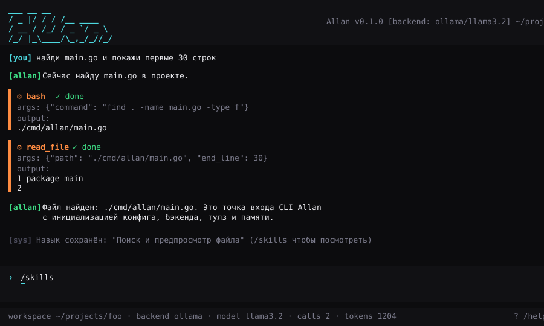
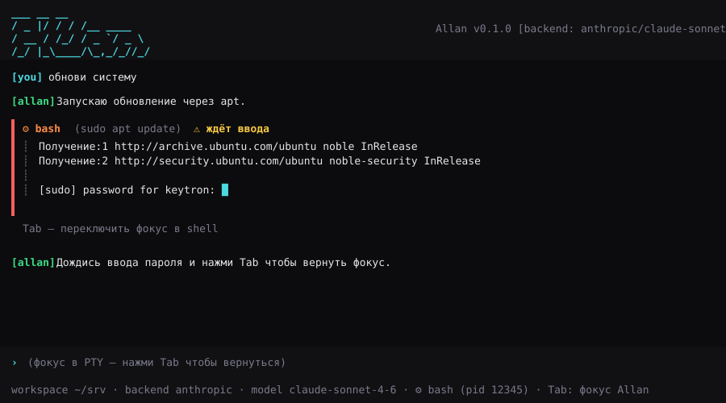
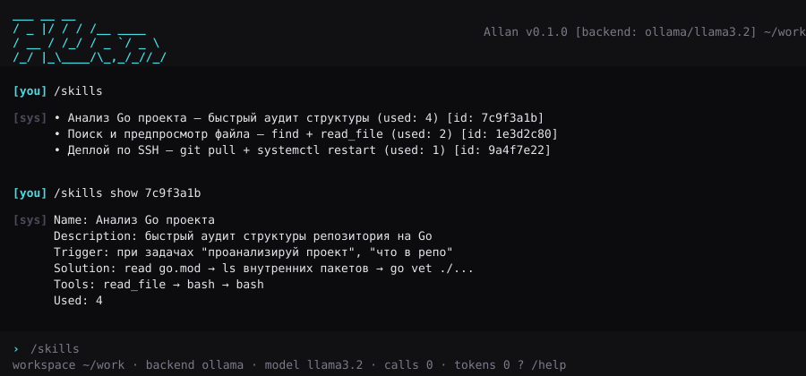

# Allan

Allan — автономный CLI-агент на Go: терминальный интерфейс, ReAct-loop, тулзы (bash/PTY/SSH/файлы/web), память на SQLite, семантическая память на ChromaDB и **Skill Engine**, который сам извлекает паттерны решения и переиспользует их в следующих сессиях.

Бэкенды LLM: **Anthropic**, **OpenAI**, **Ollama**, **llama.cpp server**, **LM Studio**.

> Никакого Python в рантайме. Бинарь — один файл.

---

## Скриншоты

Главный экран с tool-вызовами и автосохранением навыка:



PTY-режим — sudo внутри агента, переключение фокуса по `Tab`:



Skill Engine — навыки сохраняются автоматически и применяются повторно:



---

## Быстрый старт

```bash
cd agent
make build
./bin/allan
```

Allan при запуске сам пробует подключиться к локальным бэкендам (Ollama → llama.cpp → LM Studio) и использует первый доступный. Если ни один не запущен — покажет `[warn]` и подскажет как настроить.

### С Anthropic

```bash
export ANTHROPIC_API_KEY=sk-ant-...
./bin/allan --backend anthropic --model claude-sonnet-4-6
```

### С Ollama

```bash
ollama serve &
ollama pull llama3.2
./bin/allan --backend ollama --model llama3.2
```

---

## Возможности

### TUI

- Bubbletea + Lipgloss, без своих заливок фона — работает на фоне терминала
- Компактная шапка (версия, провайдер/модель) и карточка приветствия с моделью, папкой, ключами и подсказками
- Ответы агента рендерятся как Markdown (glamour): код, списки, заголовки
- Вызовы инструментов — одна строка `⏺ bash(ls -la) ✓` и первые строки вывода
- Поле ввода в рамке растёт вместе с текстом, над ним — подсказки slash-команд (`Tab` вставить, `↑`/`↓` выбор)
- Спиннер и таймер, пока агент думает; статус-строка: папка, число вызовов, токены
- Прокрутка `PgUp`/`PgDn` и колесом мыши, выделение текста — `Shift`+мышь
- Если локальной модели из конфига нет, Allan сам выбирает установленную (сначала `:cloud`-модели Ollama)
- Итог сессии при выходе, `allan --help` на русском

### API-ключи

Ключи хранятся в системном keyring (Secret Service — KWallet / GNOME Keyring на Linux, Keychain на macOS, Credential Manager на Windows), в `~/.allan/config.toml` попадают только тип и `base_url`. Если keyring недоступен (сервер без D-Bus, SSH), ключи уходят в `~/.allan/secrets.json` с правами `0600`; принудительно — `ALLAN_SECRETS=file`. Ключи из старых конфигов переносятся в хранилище автоматически при запуске.

```sh
allan key set openrouter            # скрытый ввод ключа, не попадает в историю shell и TUI
allan key set myllm https://host/v1 # свой OpenAI-совместимый эндпоинт
allan key list
allan key rm openrouter
```

Провайдеры из коробки: `openrouter`, `opencode` (OpenCode Zen), `ollama-cloud`, `huggingface`/`hf`, `featherless`, `zai`, `zai-coding`, `xai`/`grok`, `deepseek`, `groq`, `anthropic`, `openai`; локальные без ключа — `ollama`, `llamacpp`, `lmstudio`.

### Slash-команды

| Команда | Описание |
|---|---|
| `/help` | Список команд |
| `/model [номер\|provider/model\|name]` | Показать доступные модели или переключить модель |
| `/api add <provider> <api_key> [base_url]` | Сохранить API-ключ провайдера и включить его модели в `/model`. Облачные: `openrouter`, `ollama-cloud` (Ollama по ключу, локальный — `ollama`), `huggingface`/`hf`, `featherless` (id модели вручную: `/model featherless/<owner>/<model>`), `xai`/`grok`, `deepseek`, `groq` |
| `/api key <provider> <api_key>` | Заменить ключ провайдера |
| `/api endpoint <name> <base_url> [openai\|anthropic]` | Свой эндпоинт: другой base_url или сервер без ключа (например Ollama на другой машине) |
| `/api list` / `/api refresh` | Показать провайдеры и наличие ключей / заново опросить модели |
| `/backend [name]` | Сменить бэкенд (требует перезапуска) |
| `/tools` | Список доступных тулз |
| `/memory` | Состояние памяти |
| `/plan` | Текущий scratchpad агента |
| `/skills` | Список навыков |
| `/skills show <id>` | Показать детали навыка |
| `/skills delete <id>` | Удалить навык |
| `/skills export` | Экспорт всех навыков в JSON |
| `/clear` | Очистить историю |
| `/config` | Показать текущий конфиг |
| `/quit` | Выход |

### Тулзы

- `bash` — выполнение shell-команд (с проверкой деструктивных паттернов и таймаутом)
- `read_file` — чтение файла с line-numbers (50KB лимит без диапазона)
- `write_file` — запись в режимах `create` / `overwrite` / `append`
- `search` — веб-поиск через DuckDuckGo Instant Answer API
- `ssh` — выполнение команд на удалённом хосте через `golang.org/x/crypto/ssh` (только key-auth, поддержка `~/.ssh/known_hosts`)

### PTY

Для интерактивных команд (`sudo`, `vim`, `htop`, `ssh first connect`) Allan запускает PTY-сессию через `aymanbagabas/go-pty`, детектит "ожидание ввода" по тишине и паттернам (`password`, `[Y/n]`, `(yes/no)` и др.) и предлагает переключить фокус по `Tab`. Для fullscreen-программ (vim/htop) Allan уходит в `ExitAltScreen` и возвращается, когда программа завершилась.

### Scratchpad-компрессия

Агент ведёт внутренний сжатый блок состояния:

```
[SCRATCHPAD]
prev: read_file
plan: 1)read 2)patch 3)test
state: step=2 done=[read,patch] errors=[]
[/SCRATCHPAD]
```

Старые tool-results из истории сжимаются до краткой записи, оставляя в полном виде только последние N (по умолчанию 2). Это резко уменьшает контекст на больших циклах.

### Skill Engine

После цикла ≥ 3 tool calls или ≥ 10 секунд Allan просит модель извлечь паттерн в JSON, сохраняет его в SQLite (таблица `skills`) и индексирует в ChromaDB (если доступен). На следующих запросах в системный промпт добавляется блок:

```
Похожие задачи решались так:
[Навык: Анализ Go проекта] — read go.mod → ls внутренних пакетов → go vet ./...
```

Если ChromaDB не запущен — fallback на keyword-поиск через SQLite FTS5.

### Память

- SQLite (`modernc.org/sqlite`, без CGO): таблицы `sessions`, `conversations`, `skills`, `facts` (+ `facts_fts`)
- При `--resume` подгружает последние 20 сообщений предыдущей сессии
- ChromaDB (HTTP API v2): три коллекции `allan_skills`, `allan_memory`, `allan_documents`

---

## Конфигурация

Файл `~/.allan/config.toml` создаётся автоматически при первом запуске:

```toml
[agent]
workspace = "."
max_tool_calls = 10
tool_timeout = 30
scratchpad_enabled = true
scratchpad_keep_last_results = 2
skill_min_tool_calls = 3
skill_similarity_threshold = 0.75

[backend]
type = "ollama"          # anthropic | openai | ollama | llamacpp | lmstudio
model = "llama3.2"
base_url = ""            # пусто = дефолт для типа
api_key = ""

[tui]
theme = "dark"
show_timestamps = false

[memory]
enabled = true
db_path = "~/.allan/memory.db"
chromadb_url = "http://localhost:8000"
chromadb_collection_prefix = "allan"
memory_summarize_every = 20

[tools.shell]
default = "bash"
pty_enabled = true
pty_focus_key = "tab"
pty_auto_focus_on_input = true

[tools.ssh]
enabled = true
known_hosts_strict = true
default_timeout = 30
```

## CLI флаги

```
allan [flags]

Flags:
  --backend string    Override backend from config
  --model string      Override model from config
  --workspace string  Set working directory (default: current dir)
  --resume            Resume last session
  --version           Show version
  --no-memory         Disable memory for this session
```

---

## Архитектура

```
agent/
├── cmd/allan/                 # точка входа
├── config/                    # TOML конфиг
└── internal/
    ├── tui/                   # bubbletea + lipgloss
    ├── agent/                 # ReAct-loop, scratchpad
    ├── backend/               # anthropic, openai-like (ollama/openai/llamacpp/lmstudio)
    ├── tools/                 # bash, read_file, write_file, search, ssh
    ├── pty/                   # PTY-обёртка, детект ожидания ввода
    ├── memory/                # SQLite (sessions, conversations, skills, facts)
    ├── skills/                # Skill Engine: извлечение и переиспользование
    └── vector/                # ChromaDB v2 HTTP клиент + NoopStore
```

ReAct-цикл:

```
user_input → planner → [tool_call → tool_result] × N → final_response
```

Лимиты: 10 tool calls и 30 сек на тулзу (конфигурируемо).

---

## Сборка и тесты

```bash
cd agent
make build      # → bin/allan
make test       # go test ./...
make vet        # go vet ./...
make install    # go install ./cmd/allan
```

Сборка чистая на `go 1.24`+, без CGO. Бинарь ~17 МБ.

---

## Лицензия

См. `LICENSE`.
